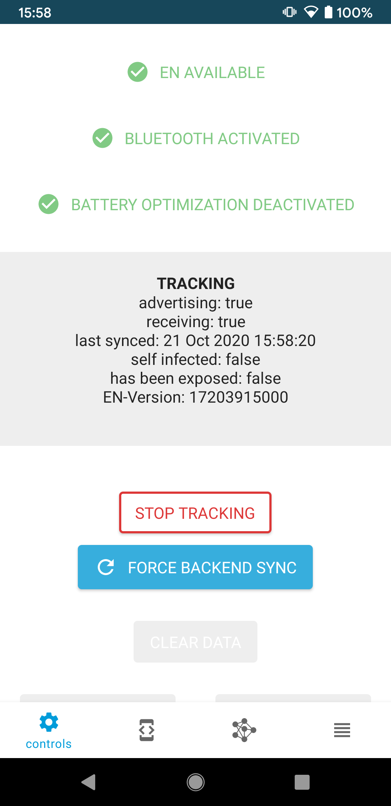
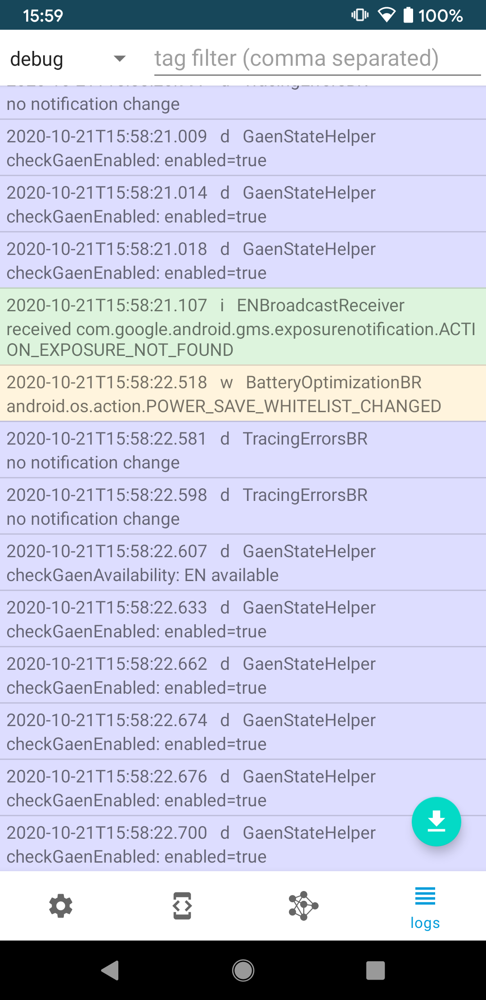

# DP3T-SDK for Android
[](https://github.com/DP-3T/dp3t-sdk-android/blob/master/LICENSE)


## DP3T
The Decentralised Privacy-Preserving Proximity Tracing (DP-3T) project is an open protocol for COVID-19 proximity tracing using Bluetooth Low Energy functionality on mobile devices that ensures personal data and computation stays entirely on an individual's phone. It was produced by a core team of over 25 scientists and academic researchers from across Europe. It has also been scrutinized and improved by the wider community.

DP-3T is a free-standing effort started at EPFL and ETHZ that produced this protocol and that is implementing it in an open-sourced app and server.


## Introduction
This is the first implementation of the DP-3T protocol using the [Exposure Notification](https://www.google.com/covid19/exposurenotifications/) Framework of Apple/Google. Only approved government public health authorities can access the APIs. Therefore, using this SDK will result in an API error unless either your account is whitelisted as test account or your app is approved by Google and signed with the production certificate.

Our prestandard solution that is not using the Apple/Google framework can be found under the [tag prestandard](https://github.com/DP-3T/dp3t-sdk-android/tree/prestandard).

## Repositories
* Android SDK & Calibration app: [dp3t-sdk-android](https://github.com/DP-3T/dp3t-sdk-android)
* iOS SDK & Calibration app: [dp3t-sdk-ios](https://github.com/DP-3T/dp3t-sdk-ios)
* Android Demo App: [dp3t-app-android](https://github.com/DP-3T/dp3t-app-android)
* iOS Demo App: [dp3t-app-ios](https://github.com/DP-3T/dp3t-app-ios)
* Backend SDK: [dp3t-sdk-backend](https://github.com/DP-3T/dp3t-sdk-backend)

## Work in Progress
The DP3T-SDK for Android contains alpha-quality code only and is not yet complete. It has not yet been reviewed or audited for security and compatibility. We are both continuing the development and have started a security review. This project is truly open-source and we welcome any feedback on the code regarding both the implementation and security aspects.
This repository contains the open prototype SDK, so please focus your feedback for this repository on implementation issues.

## Further Documentation
The full set of documents for DP3T is at https://github.com/DP-3T/documents. Please refer to the technical documents and whitepapers for a description of the implementation.

## Calibration App
Included in this repository is a Calibration App that can run, debug and test the SDK directly without implementing it in a new app first. It collects additional data and stores it locally into a database to allow for tests with phones from different vendors. Various parameters of the SDK are exposed and can be changed at runtime. Additionally it provides an overview of how to use the SDK.

<p align="center">
  
  
  
</p>

## Function overview

### Initialization
Name | Description | Function Name
---- | ----------- | -------------
initWithAppId | Initializes the SDK and configures it |  `public static void init(Context context, String appId)`

### Methods 
Name | Description | Function Name
---- | ----------- | -------------
start | Starts Bluetooth tracing | `public static void start(Context context)`
stop | Stops Bluetooth tracing | `public static void stop(Context context)`
sync | Pro-actively triggers sync with backend to refresh exposed list | `public static void sync(Context context)`
status | Returns a TracingStatus-Object describing the current state. This contains:<br/>- `numberOfContacts` : `int` <br /> - `advertising` : `boolean` <br /> - `receiving` : `boolean` <br /> - `lastSyncUpdate`:`long` <br />- `infectionStatus`:`InfectionStatus` <br />- `matchedContacts`:`List<MatchedContact>` <br /> - `errors` (permission, bluetooth disabled, no network, ...) : `List<ErrorState>` | `public static TracingStatus getStatus(Context context)`
I infected | This method must be called upon positive test. | `public static void sendIAmInfected(Context context, Date onset, ExposeeAuthData exposeeAuthData, CallbackListener<Void> callback)`
clearData | Removes all SDK related data (key and database) and de-initializes SDK | `public static void clearData(Context context, Runnable onDeleteListener)`

### Broadcast
Name | Description | Function Name
---- | ----------- | -------------
status update | Status was updated; new status can be fetched with the `status` method | Register for Broadcast with the `IntentFilter` returned by `public static IntentFilter getUpdateIntentFilter()`


## Building a AAR
To build an aar file that you can include in your project use in the folder dp3t-sdk:
```sh
$ ./gradlew assemble
```
The library is generated under sdk/build/outputs/aar

## Integrating into a Project
The SDK is available on JCenter and can be included directly as Gradle dependency:
```groovy
dependencies {
implementation 'org.dpppt:dp3t-sdk-android:0.1.0'
}
```

## Using the SDK

### Initialization
In your Application.onCreate() you have to initialize the SDK with:
```java
DP3T.init(getContext(), "com.example.your.app");
```
The provided app name has to be registered in the discovery service on [Github](https://github.com/DP-3T/dp3t-discovery/blob/master/discovery.json)

### Start / Stop tracing
To start and stop tracing use
```java
DP3T.start(getContext());
DP3T.stop(getContext());
```
To make sure the background jobs run with low delays, make sure the user disables BatteryOptimization. BatteryOptimization can be checked with
```java
PowerManager powerManager = (PowerManager) getContext().getSystemService(Context.POWER_SERVICE);
boolean batteryOptDeact = powerManager.isIgnoringBatteryOptimizations(getContext().getPackageName());
```
and for asking the user to disable the optimization use:
```java
startActivity(new Intent(Settings.ACTION_REQUEST_IGNORE_BATTERY_OPTIMIZATIONS,
					Uri.parse("package:" + getContext().getPackageName())));
```

Tracing is automatically restarted if the phone is rebooted by the SDK, it is enough to call `start()` once from your app.

### Customize tracing notification
The tracing happens in a foreground service and therefore displays a notification. This notification can be customized by defining the following string resources in your project:
```xml
<?xml version="1.0" encoding="utf-8"?>
<resources>
	<string name="dp3t_sdk_service_notification_channel">@string/app_name</string>
	<string name="dp3t_">@string/app_name</string>
	<string name="dp3t_sdk_service_notification_text">@string/foreground_service_notification_text</string>
</resources>
```
To change the notification icon add your custom ic_handshakes drawable to the project.

### Checking the current tracing status
```java
TracingStatus status = DP3T.getStatus(getContext());
```
The TracingStatus object contains all information of the current tracing status.

To get notified when the status changes, you can register a broadcast receiver with
```java
getContext().registerReceiver(broadcastReceiver, DP3T.getUpdateIntentFilter());
```

### Report user exposed
```java
DP3T.sendIWasExposed(getContext(), null, new CallbackListener<Void>() {
				@Override
				public void onSuccess(Void response) {
				}

				@Override
				public void onError(Throwable throwable) {
				}
			});
```

### Sync with backend for exposed users
The SDK automatically registers a periodic Job to sync with the backend for new exposed users. If you want to trigger a sync manually (e.g., upon a push from your backend) you can use:
```java
DP3T.sync(getContext());
```
Make sure you do not call this method on the UI thread, because it will perform the sync synchronously.
Due to rate limits on the provideDiagnosisKeys() the sync can be execute only in a very restricted manner.

## License
This project is licensed under the terms of the MPL 2 license. See the [LICENSE](LICENSE) file.
